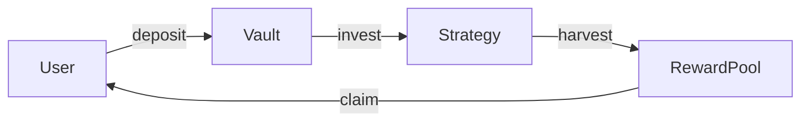
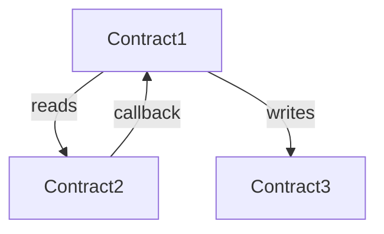

# 🐝 [PROTOCOL_NAME] — Audit Scope Report

<div align="center">

| | |
|---|---|
| **Date** | [DATE] |
| **Auditor** | [AUDITOR] |
| **Commit** | `[COMMIT_HASH]` |
| **Chain** | [EVM / Solana / Multi-chain] |
| **Framework** | [Foundry / Hardhat / Anchor] |

</div>

---

## 🔒 Threat Intelligence Scan

| Check | Status |
|-------|--------|
| Auto-exec lifecycle scripts | ✅ Clean |
| Network exfiltration patterns | ✅ Clean |
| Obfuscated payloads | ✅ Clean |
| Phishing / brand impersonation | ✅ Clean |
| Wallet draining patterns | ✅ Clean |
| Malicious dependencies | ✅ Clean |
| Backdoor functions | ✅ Clean |
| Known vulnerabilities | ✅ Clean |

**Verdict**: [CLEAN ✅ / WARNING ⚠️ / BLOCKED 🛑]

<!-- If any findings, list them: -->
<!-- - [SEVERITY] Category: detail -->

---

## 📋 Executive Summary

| Metric | Value |
|:---|:---|
| **Protocol Type** | [e.g., Vote-escrowed staking] |
| **Chain** | [EVM / Solana] |
| **Total Contracts** | [N core + M supporting] |
| **Total nSLOC** | [N lines] |
| **Overall Risk Tier** | [LOW / MEDIUM / HIGH / CRITICAL] |
| **External Dependencies** | [N packages] |

**One-paragraph summary**: [What this protocol does, how value flows through it, and what the primary risk surfaces are.]

---

## ⏱️ Estimated Effort

> **Audit Pace**: [N] nSLOC/day

| Component | nSLOC | Base Days | Complexity | Adjusted Days | Approach |
|:----------|------:|----------:|:----------:|--------------:|:---------|
| Contract1.sol | [N] | [N÷pace] | ×[M] (TIER) | [D] | Deep interrogation |
| Contract2.sol | [N] | [N÷pace] | ×[M] (TIER) | [D] | Vector scan |
| Cross-contract review | — | — | — | [D] | Interaction audit |
| PoC construction | — | — | — | [D] | For confirmed findings |
| Report writing | — | — | — | [D] | Final deliverable |

| | |
|:---|---:|
| **Total nSLOC** | **[N]** |
| **Base Effort** | **[N ÷ pace] days** |
| **Adjusted Total** | **[T] days** |

> **To recalculate**: Change the audit pace and divide total nSLOC by your new pace, then apply the complexity multiplier for each contract's risk tier.

---

## 📦 Contract Inventory

| # | Contract | Type | nSLOC | Complexity | Risk |
|--:|:---------|:-----|------:|-----------:|:-----|
| 1 | `Contract1.sol` | Core | 350 | 2.8 | 🔴 HIGH |
| 2 | `Contract2.sol` | Core | 180 | 2.1 | 🟡 MEDIUM |
| 3 | `IContract1.sol` | Interface | 45 | — | — |
| 4 | `LibHelper.sol` | Library | 60 | 1.2 | 🟢 LOW |

### External Dependencies

| Dependency | Version | Usage | Modified? |
|:-----------|:--------|:------|:---------:|
| OpenZeppelin | v4.9.3 | Access control, ERC20 | No |
| solmate | v6.2.0 | SafeTransferLib | No |

---

## 🔀 Flow Diagram



### Cross-Contract Dependencies



### Trust Assumptions

| From | To | Assumption | Risk if Broken |
|:-----|:---|:-----------|:---------------|
| Vault | Strategy | Strategy returns accurate balance | Fund loss |
| Distributor | VotingEscrow | ve balances are historically accurate | Reward theft |

---

## 🔬 Complexity & Risk Scores

| Contract | nSLOC | Ext. Integration | State Coupling | Access Control | Upgradeability | Composite | Tier |
|:---------|------:|:----------------:|:--------------:|:--------------:|:--------------:|----------:|:-----|
| Contract1.sol | 3 | 3 | 2 | 2 | 1 | 2.45 | 🟡 MEDIUM |
| Contract2.sol | 2 | 1 | 1 | 1 | 1 | 1.30 | 🟢 LOW |

---

## 🎯 Prioritized Audit Hitlist

> Functions and areas ranked by risk — audit in this order.

| Priority | Contract | Function / Area | Risk Factors | Approach |
|:--------:|:---------|:----------------|:-------------|:---------|
| 🔴 P0 | Contract1 | `withdraw()` | Value handling, cross-contract, permissionless | Deep interrogation |
| 🔴 P0 | Contract1 | `claim()` | Reward calculation, state pointer | Invariant extraction |
| 🟡 P1 | Contract2 | `deposit()` | Share calculation, first depositor | Vector scan |
| 🟡 P1 | Contract1 | `setConfig()` | Admin privilege, state reset | Checklist review |
| 🟢 P2 | Contract2 | `view functions` | Read-only | Quick review |

---

## 🛠️ Recommended Methodology

| Contract | Approach | Rationale |
|:---------|:---------|:----------|
| Contract1.sol | **Deep Interrogation** | High complexity, cross-contract value flows, multiple coupled state vars |
| Contract2.sol | **Vector Scan** | Medium complexity, standard patterns with edge cases |
| LibHelper.sol | **Checklist Review** | Low complexity, stateless library |

### Suggested Audit Flow

```
1. Scope Review (this document)           ← YOU ARE HERE
2. Invariant Extraction (all core contracts)
3. Deep Audit Pass 1: P0 targets
4. Deep Audit Pass 2: P1 targets
5. Cross-contract interaction audit
6. PoC construction for findings
7. Remediation review
```

---

## ❓ Open Questions

> [!IMPORTANT]
> Items requiring clarification from the protocol team before or during audit.

1. **[Design intent]** — Why does function X not check Y?
2. **[Expected behavior]** — What should happen when Z is zero?
3. **[Deployment]** — What chain(s) will this deploy on?
4. **[Roles]** — Is the owner a multisig or EOA?
5. **[Known issues]** — Are there any known issues or accepted risks?

---

## 📎 Appendix: Files Out of Scope

| File | Reason |
|:-----|:-------|
| `test/*.sol` | Test files |
| `script/*.sol` | Deployment scripts |
| `lib/**` | Third-party dependencies (unmodified) |
