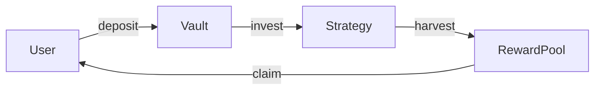
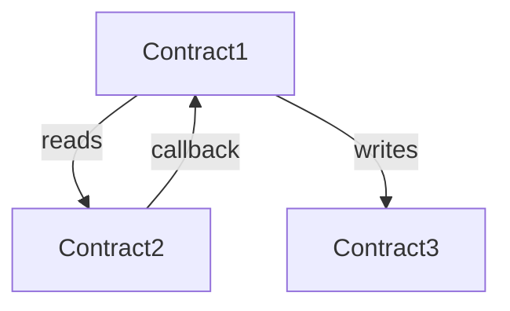

# 🐝 [PROTOCOL_NAME] — Audit Scope Report

> **Date**: [DATE]  
> **Auditor**: [AUDITOR]  
> **Commit**: [COMMIT_HASH]  
> **Chain**: [EVM / Solana / Multi-chain]  
> **Framework**: [Foundry / Hardhat / Anchor]  
> **Audit Pace**: [N] nSLOC/day

---

## 0. Malware Scan Results

| Severity | Count | Status |
|----------|-------|--------|
| 🔴 HIGH | 0 | ✅ Clean |
| 🟡 MEDIUM | 0 | ✅ Clean |
| 🟢 LOW | 0 | ✅ Clean |

**Verdict**: [CLEAN / WARNING / BLOCKED]

<!-- If any findings, list them: -->
<!-- - [SEVERITY] Category: detail -->

---

## 1. Executive Summary

| Metric              | Value                          |
|---------------------|--------------------------------|
| Protocol Type       | [e.g., Vote-escrowed staking]  |
| Chain               | [EVM / Solana]                 |
| Total Contracts     | [N core + M supporting]        |
| Total nSLOC         | [N lines]                      |
| Overall Risk Tier   | [LOW / MEDIUM / HIGH / CRITICAL] |
| Audit Pace          | [N] nSLOC/day                  |
| Estimated Effort    | [N days]                       |
| External Dependencies | [N packages]                 |

**One-paragraph summary**: [What this protocol does, how value flows through it, and what the primary risk surfaces are.]

---

## 2. Contract Inventory

| # | Contract | Classification | nSLOC | Complexity | Risk Tier |
|---|----------|---------------|-------|------------|-----------|
| 1 | `Contract1.sol` | Core | 350 | 2.8 | HIGH |
| 2 | `Contract2.sol` | Core | 180 | 2.1 | MEDIUM |
| 3 | `IContract1.sol` | Interface | 45 | — | — |
| 4 | `LibHelper.sol` | Library | 60 | 1.2 | LOW |

### External Dependencies

| Dependency | Version | Usage | Modified? |
|-----------|---------|-------|-----------|
| OpenZeppelin | v4.9.3 | Access control, ERC20 | No |
| solmate | v6.2.0 | SafeTransferLib | No |

---

## 3. Architectural Context

```json
{
  "protocol_type": "",
  "token_model": "",
  "accounting_model": "",
  "upgradeability_model": "",
  "value_flow": [
    ""
  ],
  "trust_boundaries": [
    ""
  ]
}
```

### Value Flow Diagram



---

## 4. System Maps

### 4.1 [Contract1.sol]

```json
{
  "contract": "Contract1.sol",
  "inheritance": [],
  "entrypoints": [],
  "state_variables": [],
  "roles": [],
  "external_calls": [],
  "delegatecalls": [],
  "modifiers": [],
  "events": [],
  "value_holding": "",
  "key_invariants": []
}
```

<!-- Repeat for each core contract -->

### Solana/Anchor Programs (if applicable)

#### [ProgramName]

```json
{
  "program": "ProgramName",
  "instructions": [
    {
      "name": "instruction_name",
      "accounts": ["account: type, mutable?, signer?, PDA?"],
      "args": ["param: type"],
      "access_control": "who can call",
      "cpi_calls": ["program::function"],
      "state_changes": ["what accounts modified"],
      "key_validations": ["constraint checks"]
    }
  ],
  "pda_derivations": [
    {"name": "vault_pda", "seeds": ["\"vault\"", "user.key()"], "bump": "canonical"}
  ]
}
```

<!-- Repeat for each program -->

---

## 5. Cross-Contract Dependencies



### Trust Assumptions

| From | To | Assumption | Risk if Broken |
|------|----|-----------|----------------|
| Vault | Strategy | Strategy returns accurate balance | Fund loss |
| Distributor | VotingEscrow | ve balances are historically accurate | Reward theft |

---

## 6. Attack Surface Matrix

| # | Attack Surface | Status | Affected Contracts | Notes |
|---|---------------|--------|-------------------|-------|
| 1 | Reentrancy (same-contract) | | | |
| 2 | Reentrancy (cross-contract) | | | |
| 3 | Delegatecall storage collision | | | |
| 4 | Authorization bypass | | | |
| 5 | ERC20 non-standard behavior | | | |
| 6 | Oracle manipulation | | | |
| 7 | Precision loss / rounding | | | |
| 8 | Share inflation / first depositor | | | |
| 9 | Flash loan vectors | | | |
| 10 | Timestamp / block dependency | | | |
| 11 | Unchecked low-level calls | | | |
| 12 | Storage packing collisions | | | |
| 13 | Gas griefing / DoS | | | |
| 14 | Reward index desynchronization | | | |
| 15 | Signature replay / EIP-712 | | | |
| 16 | Front-running / MEV | | | |
| 17 | Integer overflow (unchecked) | | | |
| 18 | Initialization / constructor | | | |
| 19 | Self-destruct / codeless | | | |
| 20 | Cross-chain / bridge replay | | | |

---

## 7. Complexity & Risk Scores

### Per-Contract Breakdown

| Contract | nSLOC | Ext. Integration | State Coupling | Access Control | Upgradeability | Composite | Tier |
|----------|-------|-----------------|----------------|----------------|---------------|-----------|------|
| Contract1.sol | 3 | 3 | 2 | 2 | 1 | 2.45 | MEDIUM |
| Contract2.sol | 2 | 1 | 1 | 1 | 1 | 1.30 | LOW |

---

## 8. Prioritized Audit Hitlist

> Functions and areas ranked by risk. Audit in this order.

| Priority | Contract | Function/Area | Risk Factors | Recommended Approach |
|----------|----------|--------------|-------------|---------------------|
| 🔴 P0 | Contract1 | `withdraw()` | Value handling, cross-contract, permissionless | Nemesis interrogation |
| 🔴 P0 | Contract1 | `claim()` | Reward calculation, state pointer | Invariant extraction |
| 🟡 P1 | Contract2 | `deposit()` | Share calculation, first depositor | Pashov vector scan |
| 🟡 P1 | Contract1 | `setConfig()` | Admin privilege, state reset | Standard review |
| 🟢 P2 | Contract2 | `view functions` | Read-only | Quick review |

---

## 9. Recommended Methodology

| Contract | Approach | Rationale |
|----------|----------|-----------|
| Contract1.sol | **Full Nemesis** | High complexity, cross-contract value flows, multiple coupled state vars |
| Contract2.sol | **Pashov Vector Scan** | Medium complexity, standard patterns with edge cases |
| LibHelper.sol | **Standard Checklist** | Low complexity, stateless library |

### Suggested Audit Flow

```
1. Scope Review (this document) ← YOU ARE HERE
2. Invariant Extraction (all core contracts)
3. Deep Audit Pass 1: Nemesis on P0 targets
4. Deep Audit Pass 2: Pashov vectors on P1 targets
5. Cross-contract interaction audit
6. PoC construction for findings
7. Remediation review
```

---

## 10. Estimated Effort

> **Audit Pace**: [N] nSLOC/day (configurable — adjust and recalculate below)

| Component | nSLOC | Base Days | Multiplier | Adjusted Days | Notes |
|-----------|-------|-----------|------------|---------------|-------|
| Contract1.sol | [N] | [N÷pace] | ×[M] (TIER) | [D] | Nemesis |
| Contract2.sol | [N] | [N÷pace] | ×[M] (TIER) | [D] | Pashov |
| Cross-contract review | — | — | — | [D] | Interaction audit |
| PoC construction | — | — | — | [D] | For confirmed findings |
| Report writing | — | — | — | [D] | Final deliverable |
| **Total** | **[N]** | **[B]** | | **[T] days** | |

**To recalculate**: Change the audit pace and divide total nSLOC by your new pace, then apply the complexity multiplier for each contract's risk tier.

---

## 11. Open Questions

> [!IMPORTANT]
> Items requiring clarification from the protocol team before or during audit.

1. **[Question about design intent]** — Why does function X not check Y?
2. **[Question about expected behavior]** — What should happen when Z is zero?
3. **[Question about deployment]** — What chain(s) will this deploy on?
4. **[Question about roles]** — Is the owner a multisig or EOA?
5. **[Question about known issues]** — Are there any known issues or accepted risks?

---

## Appendix: Files Out of Scope

| File | Reason |
|------|--------|
| `test/*.sol` | Test files |
| `script/*.sol` | Deployment scripts |
| `lib/**` | Third-party dependencies (unmodified) |
