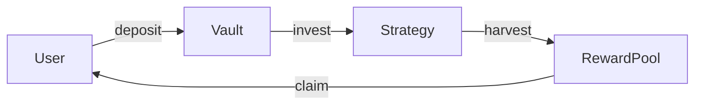
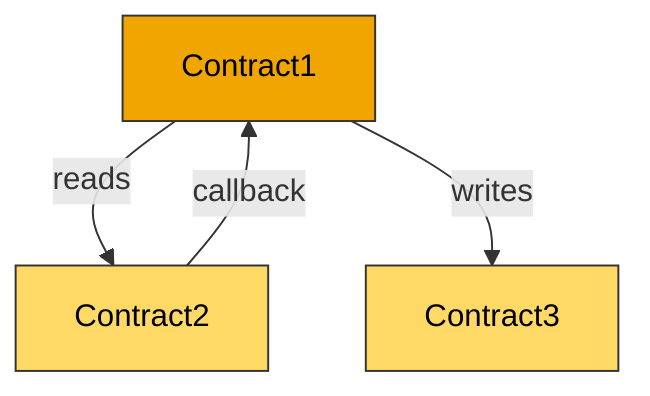

<div align="center">

# 🐝 [PROTOCOL_NAME] — Audit Scope Report

**`━━━━⬡⬡⬡━━━━ SCOPING BEE ━━━━⬡⬡⬡━━━━`**

</div>

<table align="center">
<tr><td>🗓️ <b>Date</b></td><td>[DATE]</td></tr>
<tr><td>🔍 <b>Auditor</b></td><td>[AUDITOR]</td></tr>
<tr><td>🔗 <b>Commit</b></td><td><code>[COMMIT_HASH]</code></td></tr>
<tr><td>⛓️ <b>Chain</b></td><td>[EVM / Solana / Multi-chain]</td></tr>
<tr><td>🛠️ <b>Framework</b></td><td>[Foundry / Hardhat / Anchor]</td></tr>
</table>

---

<div align="center">

### ⬡ HIVE SECTION 1 ⬡

</div>

## 🛡️ Threat Intelligence Scan

```
┌─────────────────────────────────────────────────────────┐
│  🐝 HIVE SECURITY SWEEP                     VERDICT: ✅ │
├─────────────────────────────────────────────────────────┤
│  ⬡ Auto-exec lifecycle scripts        ··········  CLEAN │
│  ⬡ Network exfiltration patterns       ··········  CLEAN │
│  ⬡ Obfuscated payloads                ··········  CLEAN │
│  ⬡ Phishing / brand impersonation     ··········  CLEAN │
│  ⬡ Wallet draining patterns           ··········  CLEAN │
│  ⬡ Malicious dependencies             ··········  CLEAN │
│  ⬡ Backdoor functions                 ··········  CLEAN │
│  ⬡ Known vulnerabilities              ··········  CLEAN │
├─────────────────────────────────────────────────────────┤
│  🍯 All clear — safe to proceed with deep analysis.     │
└─────────────────────────────────────────────────────────┘
```

<!-- If any findings, replace CLEAN with finding status and add details below -->
<!-- - [SEVERITY] Category: detail -->

---

<div align="center">

### ⬡ HIVE SECTION 2 ⬡

</div>

## 📋 Executive Summary

```
  ╔══════════════════════════════════════════════════════╗
  ║  🐝 PROTOCOL AT A GLANCE                            ║
  ╠══════════════════════════════════════════════════════╣
  ║  Protocol Type   ▸ [e.g., Vote-escrowed staking]   ║
  ║  Chain           ▸ [EVM / Solana]                   ║
  ║  Total Contracts ▸ [N core + M supporting]          ║
  ║  Total nSLOC     ▸ [N lines]                        ║
  ║  Risk Tier       ▸ [LOW / MEDIUM / HIGH / CRITICAL] ║
  ║  Dependencies    ▸ [N packages]                     ║
  ╚══════════════════════════════════════════════════════╝
```

**One-paragraph summary**: [What this protocol does, how value flows through it, and what the primary risk surfaces are.]

---

<div align="center">

### ⬡ HIVE SECTION 3 ⬡

</div>

## ⏱️ Estimated Effort

```
  ┌──────────────────────────────────────────────┐
  │  🐝 AUDIT PACE: [N] nSLOC/day               │
  │  ─────────────────────────────────────────── │
  │  Total nSLOC      ▸  [N]                     │
  │  Base Effort       ▸  [N ÷ pace] days        │
  │  Adjusted Total    ▸  [T] days  🍯           │
  └──────────────────────────────────────────────┘
```

| ⬡ Component | nSLOC | Base Days | Complexity | Adjusted Days | Approach |
|:------------|------:|----------:|:----------:|--------------:|:---------|
| 🔴 Contract1.sol | [N] | [N÷pace] | ×[M] (TIER) | [D] | Deep interrogation |
| 🟡 Contract2.sol | [N] | [N÷pace] | ×[M] (TIER) | [D] | Vector scan |
| 🔗 Cross-contract review | — | — | +20% | [D] | Interaction audit |
| 💥 PoC construction | — | — | — | [D] | For confirmed findings |
| 📝 Report writing | — | — | — | [D] | Final deliverable |

> **To recalculate**: Change the audit pace and divide total nSLOC by your new pace, then apply the complexity multiplier for each contract's risk tier (LOW ×1.0, MEDIUM ×1.3, HIGH ×1.7, CRITICAL ×2.2).

---

<div align="center">

### ⬡ HIVE SECTION 4 ⬡

</div>

## 📦 Contract Inventory

### 🍯 Core Contracts (The Honeycomb)

<!-- Assign bee roles based on contract responsibility:
     👑 Queen  — main orchestrator / entry point
     🏗️ Builder — state management / core logic
     🔧 Worker  — utility / encoding / helpers
     🐝 Guard   — access control / authorization
     🍯 Honeypot — value storage / treasury
-->

| # | ⬡ Contract | Role | nSLOC | Score | Risk |
|--:|:-----------|:-----|------:|------:|:-----|
| 1 | `Contract1.sol` | 👑 Queen — [role description] | 350 | 2.8 | 🟠 HIGH |
| 2 | `Contract2.sol` | 🏗️ Builder — [role description] | 180 | 2.1 | 🟡 MEDIUM |
| 3 | `LibHelper.sol` | 🔧 Worker — [role description] | 60 | 1.2 | 🟢 LOW |

### 🔌 Interfaces

| # | Interface | Purpose |
|--:|:----------|:--------|
| 4 | `IContract1.sol` | [purpose] |

### 📦 External Dependencies

| Dependency | Version | Usage | Modified? |
|:-----------|:--------|:------|:---------:|
| OpenZeppelin | v4.9.3 | Access control, ERC20 | No |
| solmate | v6.2.0 | SafeTransferLib | No |

---

<div align="center">

### ⬡ HIVE SECTION 5 ⬡

</div>

## 🔀 Flow Diagram

### 🐝 The Waggle Dance — Value Flow



### 🕸️ Cross-Contract Dependencies



### 🔗 Trust Assumptions

| From | ➜ To | Assumption | 💀 Risk if Broken |
|:-----|:-----|:-----------|:-----------------|
| Vault | Strategy | Strategy returns accurate balance | Fund loss |
| Distributor | VotingEscrow | ve balances are historically accurate | Reward theft |

---

<div align="center">

### ⬡ HIVE SECTION 6 ⬡

</div>

## 🔬 Complexity & Risk Scores

| ⬡ Contract | nSLOC | Ext. | State | Access | Upgrade | Composite | Tier |
|:-----------|------:|:----:|:-----:|:------:|:-------:|----------:|:-----|
| Contract1.sol | 3 | 3 | 2 | 2 | 1 | **2.45** | 🟡 MEDIUM |
| Contract2.sol | 2 | 1 | 1 | 1 | 1 | **1.30** | 🟢 LOW |

```
  🐝 Scoring Rationale
  ─────────────────────────────────────────────────────────
  ⬡ Contract1 — [brief rationale for score]

  ⬡ Contract2 — [brief rationale for score]
  ─────────────────────────────────────────────────────────
```

---

<div align="center">

### ⬡ HIVE SECTION 7 ⬡

</div>

## 🎯 Prioritized Audit Hitlist

> 🐝 Functions ranked by sting risk — audit in this order.

### 🔴 P0 — Critical Sting Zone

| ⬡ Contract | Function / Area | Risk Factors |
|:-----------|:----------------|:-------------|
| Contract1 | `withdraw()` | Value handling, cross-contract, permissionless |
| Contract1 | `claim()` | Reward calculation, state pointer |

### 🟡 P1 — Watch Zone

| ⬡ Contract | Function / Area | Risk Factors |
|:-----------|:----------------|:-------------|
| Contract2 | `deposit()` | Share calculation, first depositor |
| Contract1 | `setConfig()` | Admin privilege, state reset |

### 🟢 P2 — Low Pollen

| ⬡ Contract | Function / Area | Risk Factors |
|:-----------|:----------------|:-------------|
| Contract2 | `view functions` | Read-only |

---

<div align="center">

### ⬡ HIVE SECTION 8 ⬡

</div>

## 🛠️ Recommended Methodology

| ⬡ Contract | Approach | Rationale |
|:-----------|:---------|:----------|
| Contract1.sol | **🔴 Deep Interrogation** | High complexity, cross-contract value flows, multiple coupled state vars |
| Contract2.sol | **🟡 Vector Scan** | Medium complexity, standard patterns with edge cases |
| LibHelper.sol | **🟢 Checklist Review** | Low complexity, stateless library |

### 🐝 Suggested Audit Flow

```
  ⬡─────────────────────────────────────────────────────────────⬡
  │                                                              │
  │  1. 📋 Scope Review (this document)         ← YOU ARE HERE  │
  │         │                                                    │
  │  2. 🔍 Invariant Extraction (all core contracts)            │
  │         │                                                    │
  │  3. 🔴 Deep Audit Pass 1 — P0 targets                      │
  │         │                                                    │
  │  4. 🟡 Deep Audit Pass 2 — P1 targets                      │
  │         │                                                    │
  │  5. 🔗 Cross-contract interaction audit                     │
  │         │                                                    │
  │  6. 💥 PoC construction for findings                        │
  │         │                                                    │
  │  7. ✅ Remediation review                                   │
  │                                                              │
  ⬡─────────────────────────────────────────────────────────────⬡
```

---

<div align="center">

### ⬡ HIVE SECTION 9 ⬡

</div>

## ❓ Open Questions

> [!IMPORTANT]
> 🐝 Items requiring clarification from the protocol team before or during audit.

| # | Topic | Question |
|--:|:------|:---------|
| 1 | **[Design intent]** | Why does function X not check Y? |
| 2 | **[Expected behavior]** | What should happen when Z is zero? |
| 3 | **[Deployment]** | What chain(s) will this deploy on? |
| 4 | **[Roles]** | Is the owner a multisig or EOA? |
| 5 | **[Known issues]** | Are there any known issues or accepted risks? |

---

<div align="center">

### ⬡ HIVE SECTION 10 ⬡

</div>

## 📎 Appendix: Files Out of Scope

| File | Reason |
|:-----|:-------|
| `test/*.sol` | Test files |
| `script/*.sol` | Deployment scripts |
| `lib/**` | Third-party dependencies (unmodified) |

---

<div align="center">

```
  ⬡⬡⬡⬡⬡⬡⬡⬡⬡⬡⬡⬡⬡⬡⬡⬡⬡⬡⬡⬡⬡⬡⬡⬡⬡⬡⬡⬡⬡⬡⬡⬡
  🐝  Generated by Scoping Bee  •  [AUDITOR]  🍯
  ⬡⬡⬡⬡⬡⬡⬡⬡⬡⬡⬡⬡⬡⬡⬡⬡⬡⬡⬡⬡⬡⬡⬡⬡⬡⬡⬡⬡⬡⬡⬡⬡
```

</div>
